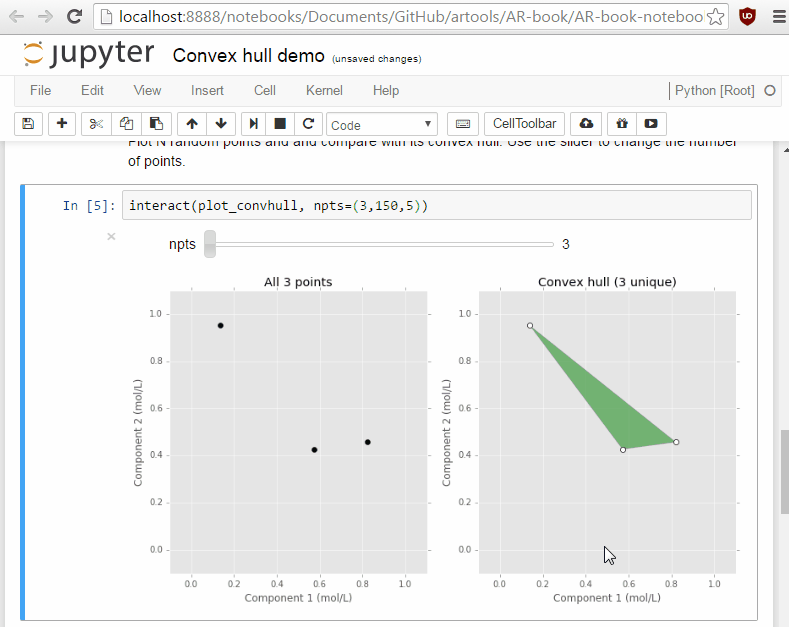

# Attainable Region (AR) Tools

This is the GitHub repository of Attainable Region (AR) theory. The main homepage of AR theory can be found at [attainableregions.com](http://attainableregions.com "AR theory homepage").

This repository contains:
1. Python functions for carrying out AR computations, `artools.py`
2. Interactive Jupyter notebooks that describe the basics of AR theory
3. Source code for the examples found on attainableregions.com

## 1. AR tools
`artools.py` is a collection of Python functions for carrying out AR calculations as well as performing simple 2-D and 3-D visualisations of convex regions. A Jupyter notebook demonstrating its usage can be found in the [notebooks folder](./AR-book/AR-book-notebooks/Ch%208/artools%20demos.ipynb).

### 1.1 Usage
Copy `artools.py` to your local directory and import.
```python
import artools
```

Alternatively, add the directory containing `artools.py` to your system path, and then import.
```python
import sys
sys.path.append('PATH/TO/ARTOOLS/DIRECTORY')

import artools
```

### 1.2 Dependencies
Currently, `artools.py` is written in Python 2.7 and depends on [SciPy](https://www.scipy.org/) and [Matplotlib](https://matplotlib.org/). We recommend using [Anaconda](https://www.continuum.io/downloads) to manage the installation of these packages.

## 2. Jupyter notebooks


Jupyter notebooks can be found [here](./AR-book/AR-book-notebooks) that help to demonstrate a number of common AR theory concepts. These notebooks are written in conjunction with the [attainable region theory textbook](http://eu.wiley.com/WileyCDA/WileyTitle/productCd-1119157889.html).

## 3. AR website examples
The source code for the examples described on attainableregions.com are stored [here](./AR-book/website-examples).
